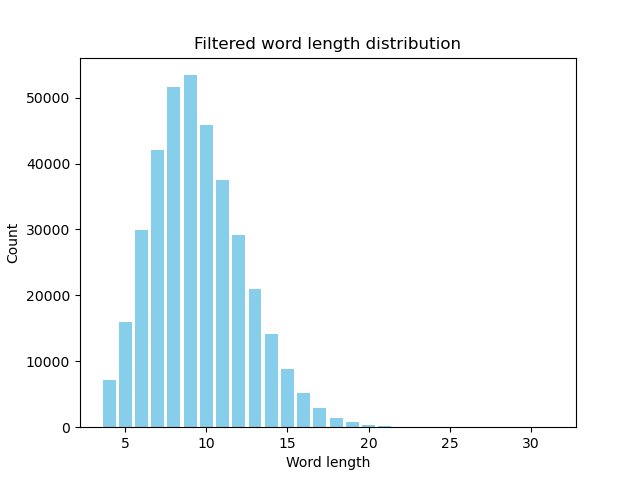

# Solo-Player Design Document

[toc]

## Overview

Idiot solo-player implements the Idiot game. The limitation to a single player provides solo practice for the single player, of which they can then challenge real human players with. On the implementation side, it also abstracts the networking component of real-time multiplayer online.

## Rules

Idiot is a word game. Players take turns adding one letter at a time to the start or end of string. The goal of the game is to not add the final letter that would form a word. The word must be at least 4 letters long. If a player completes a word, the player loses the round.

Additionally, if any `player A` believes that no word contains the current string as a substring, they can "challenge" the previous `player B`. When "challenged", the previous `player B` must come up with a word that contains the current string as a substring.
* If no such word can be created, then the previous `player B` loses the round
* If a word can be created, then current `player A` loses the round

When a player loses the round, they gain a letter in "IDIOT". That player starts the next round (the first round can be started by the solo player). Once a player gains all 5 letters, they lose the game.

## Example Game Flow

```
-- Round 1 Start --
Player 1: "a"
Player 2: "ca"
Player 3: "cal"
Player 1: "ocal"
Player 2: "ocale"
Player 3: "ocales"
Player 1: <Can't think of any word>
Player 1: Challenge
Player 3: "locales"
Player 1: <Gains letter "I">
-- Round 1 End --

-- Round 2 Start --
Player 1: "z"
Player 2: "ze"
Player 3: "zeb"
Player 1: "zebr"
Player 2: "zebra"
Player 2: <Gains letter "I">
-- Round 2 End --

-- Round 3 Start --
Player 2: "q"
Player 3: "qn"
Player 1: "lqn"
Player 2: Challenge
Player 1: "hlqn"
Player 2: <Gains letter "D">
-- Round 3 End --
```

## Game State

The state of the game can be held by a struct. We want to manage:
* Current Player
* Current String
* Set of possible words from the current String
  * Computed from static set of all possible words
* Challenge State
* Player Order

## Tunable Settings

To customize the game for solo practice, we may want to support:
* Number of CPUs (Up to arbitrary 8 total players)
* Optimality of CPU plays (Difficulty level)

## CPU Players

### Easy

The easy player has some foresight, choosing a letter that does not form a word. The basic logic might be as follows:

```
On CPU Player Turn:
  If current substring is not in any words:
    Challenge the previous player
    End Turn
  
  Compute all words with the current substring as a substring 
  Choose a random word with length that does not kill self to pursue
    Does not kill self: word length is not so that this CPU player would finish the word
    If this is not possible, choose a random word instead
  Choose a random position to add the letter to (start or end)
  End Turn
```

### Medium

The medium player has some more foresight, choosing a letter that does not form a word, weighted by a cost associated with each word to pursue.

```
On CPU Player Turn:
  If current substring is not in any words:
    Challenge the previous player
    End Turn
  
  Compute all words with the current substring as a substring 
  For each of 52 choices to add a letter:
    Compute all words with the candidate substring as a substring 
    Begin computing a score
      +inf if candidate substring is a word
      +1 for each word that results in killing self
        +10 instead if the candidate is a suffix/prefix of the word that kills self
  Exponentially weight each score and select a candidate substring randomly
    Weight using softmax on e^{-score}
  End Turn
```

An alternative to a weighted random selection can be a deterministic selection on the min score, with ties broken by the candidate substring with the least number of total possible words. However, this may cause the CPU to become too predictable.

This decision may be revisited after live testing.

### Hard

This difficulty is currently out of scope. It could be implemented in the future using more sophisticated future-simulation and game states.

## Word Dataset

The dataset of valid words will consist of those that only consist of alphabet characters and are greater than 3 letters long, from the [english-words](https://github.com/dwyl/english-words/tree/master) repo.

```bash
wget https://raw.githubusercontent.com/dwyl/english-words/refs/heads/master/words_alpha.txt
```

At instantiation, the word set can be extracted from a json file and parsed. There are two options for how to parse the dataset after filtering.

### Option 1: Raw Set

We can simply store the set of valid words. For each Current String, we would iterate over all valid words and run a brute-force or the KMP algorithm to check whether the Current String is a substring of the word in the set. The would be most straightforward.

At CPU decision time, we can simply perform scoring or random selection over the available set.

### Option 2: Trie

We can also use some sort of Trie structure. This is less intuitive than a list of words, but does not require any substring lookup for each word each turn. Instead, the problem is reduced to tree traversal problem.

At CPU decision time, we can run layered BFS to represent the possible words and their respective word lengths. Each layer represents a possible word, and we would avoid words with length that would result in the CPU completing the word on that layer.

### Analysis

The Raw Set can store ~400k words as a .txt file using 3.9 MB. The Trie must store structural information, and is dependent on the number of Trie Nodes. From some internal testing, based on the structure of the words, there are ~2.8 million substrings. This takes 93 MB to store a json mapping each substring to two bitsets representing the up to 52 characters that can be added to the start or end of each substring.

As such, it is recommended to simply use a Raw Set. The iteration over ~400k words also does not have too much overhead, given that there are only about 10 characters per word.



## Front End

The front end will offer two main pages: Settings and a chat message structure. 

### Settings

This sets values to be used in gameplay. Namely:
* Number of CPUs
* Difficulty for each CPU

The menu can offer buttons to add or remove CPUs, and a dropdown for the difficulty of each CPU.

### Chat Message

This is stylized using CSS. 

Each chat message will be the full substring. For user inputs, it can be checked that only one lowercase English alphabet character has been appended to the start or end of the previous player's substring.

## Hosting

The project will be hosted on Github Pages. The code will be written with a javascript front-end that holds CPU logic and game state.

## Class Structure

Backend Components:
* [Game State](#game-state)
* CPU Players
  * Possible Words: A central set of current possible words containing the current substring can be accessed by all CPU players for their play decisions
  * Number of letters in IDIOT
* Human Player
  * Number of letters in IDIOT

Frontend Components:
* Chat window
* Settings window

## Testing

* Unit test: Basic functionality will be tested on set creation and input parsing
* Integration test: CPU behavior can be compared using seeded randomness and comparisons with distributions

## Challenges

* The main challenge comes from the overall difficulty. The Hard CPU could be more sophisticated, and easier CPUs might be figured out/tricked by the user.
* It is unclear what the javascript runtime to compute all words containing the current substring. The current tests in Python have been very fast, but there could be more limitations with this living in the frontend of a site.